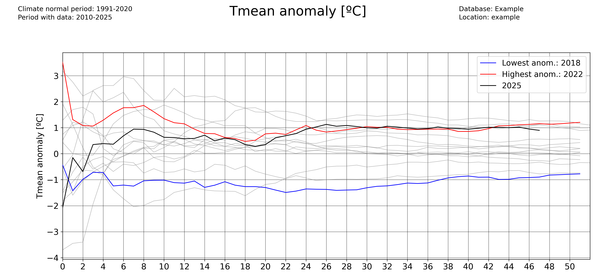
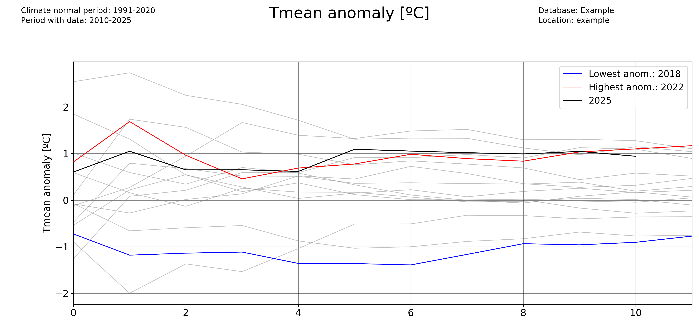
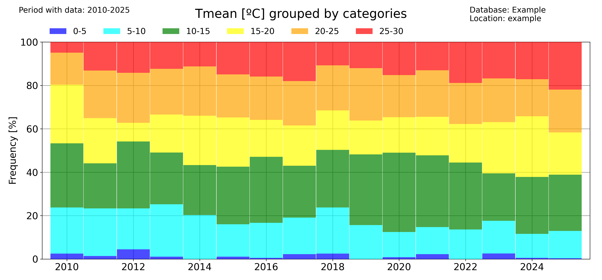
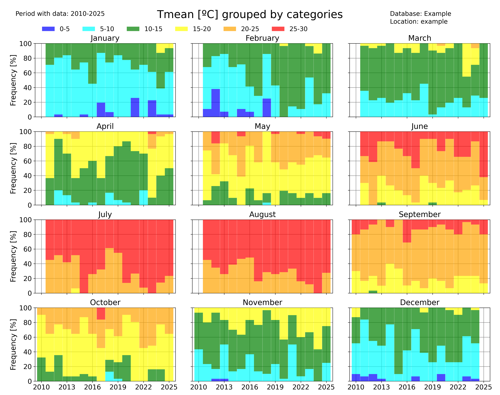
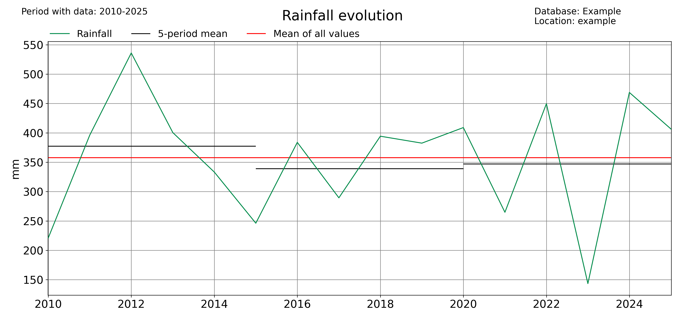

Plotting examples
=================

The examples below show how pyClim can be used to make plots. The examples do not cover the whole functionalities of pyClim, but a subset of the most important plotting features. This documentation will be updated progressively to include the remaining functionalities.

All of the examples below make use of the example dataset included in this package, which the user can use for testing purposes.

Loading the example data
------------------------

The first step for plotting is, of course, to load the data:

.. code:: python

    import numpy as np
    import matplotlib.pyplot as plt
    import matplotlib
    import pandas as pd
    import datetime as dt

    from pandas import Grouper, DataFrame
    import os
    import glob

    from scipy import stats, interpolate, signal

    # Import pyclim
    from pyclim_test import *

    # Load the example data
    path = "%s/data/" % os.getcwd()
    csvfiles = glob.glob(os.path.join(path, "example_data.txt"))
    print(csvfiles)

    # Create metadata
    metadata = pd.DataFrame(["example", "example", 361.00, -361.00, 461]).T
    metadata.columns = ["Estacion", "Codigo", "latitud_OK", "longitud_OK", "Altitud"]

    # Some useful variables
    year_to_plot = 2025
    climate_normal_period = [1991, 2020]
    variables = ["Tmin", "Tmean", "Tmax", "Rainfall", "WindSpeed"]
    database = "Example"

    # Mapping variables
    units_list = {}  # ['ºC','ºC','ºC', 'm/s']
    units_list["Tmin"] = "ºC"
    units_list["Tmean"] = "ºC"
    units_list["Tmax"] = "ºC"
    units_list["Rainfall"] = "mm"
    units_list["WindSpeed"] = "m/s"

    wd_map = {
        "N": 0,
        "NNE": 22.5,
        "NE": 45,
        "ENE": 67.5,
        "E": 90,
        "ESE": 112.5,
        "SE": 125,
        "SSE": 147.5,
        "S": 180,
        "SSW": 202.5,
        "SW": 225,
        "WSW": 247.5,
        "W": 270,
        "WNW": 292.5,
        "NW": 315,
        "NNW": 337.5,
    }

    # Select metadata
    metadatos_sta = metadata[metadata.ID == "example"]
    codigo_sta = metadatos_sta.ID.values[0]
    # nombres_mod[listanombres] = nombres_mod[listanombres].replace('/','-')
    station_name = str(metadatos_sta.Name.values[0])
    station_name = station_name.replace("/", "-")

    plotdir = os.path.join(os.getcwd(), "plots/%s/%s" % (database, "example"))
    plotdir = plotdir.replace("\\", "/")
    if os.path.isdir(plotdir) == False:
        try:
            os.mkdir(plotdir)
        except OSError:
            print("Creation of the directory %s failed" % plotdir)
        else:
            print("Successfully created the directory %s " % plotdir)

    # Read data
    input_file = [x for x in csvfiles if codigo_sta in x][0]
    df1 = pd.read_csv(input_file, sep=";", decimal=",", header=0, encoding="latin-1")

    df1["Date"] = pd.to_datetime(df1.iloc[:, 0])
    df1 = df1.set_index("Date")

    df1["Day"] = df1.index.day
    df1["Month"] = df1.index.month
    df1["Year"] = df1.index.year
    df1["Accumpcp"] = df1.groupby(df1.index.year)["Rainfall"].cumsum()

Plotting a timeseries of anomalies
----------------------------------
The 'freq' parameter allows to choose the temporal aggregation of the anomalies. For example, for daily anomalies use freq='1D':

.. image:: ../examples/plots/daily_anomalies_Tmean.png

.. code:: python

    plot_anomalies(
        df1_complete,
        "Tmean",
        "ºC",
        climate_normal_period,
        database,
        station_name,
        plotdir + "/daily_anomalies_Tmean.png",
        window=12,
        freq="1D",
    )

And for monthly anomalies, freq='1ME':

.. image:: ../examples/plots/monthly_anomalies_Tmean.png

.. code:: python

    plot_anomalies(
        df1_complete,
        "Tmean",
        "ºC",
        climate_normal_period,
        database,
        station_name,
        plotdir + "/monthly_anomalies_Tmean.png",
        window=12,
        freq="1ME",
    )

Plotting accumulated anomalies
------------------------------

Use the :func:`pyclim.plot_accumulated_anomalies` function to plot the accumulated anomalies during a year. Again, the 'freq' parameter allows the user to vary the temporal aggregation of the accumulated anomalies.

Accumulated anomalies from day to day:

.. image:: ../examples/plots/Tmean_accum_anoms_daily.png

.. code:: python

    plot_accumulated_anomalies(
        df1_complete,
        "Tmean",
        "ºC",
        2025,
        climate_normal_period,
        database,
        station_name,
        plotdir + "/Tmean_accum_anoms_daily.png",
        freq="1D",
    )

Weekly accumulated anomalies:

.. code:: python

    plot_accumulated_anomalies(
        df1_complete,
        "Tmean",
        "ºC",
        2025,
        climate_normal_period,
        database,
        station_name,
        plotdir + "/Tmean_accum_anoms_daily.png",
        freq="1D",
    )

Monthly accumulated anomalies:

.. code:: python

    plot_accumulated_anomalies(
        df1_complete,
        "Tmean",
        "ºC",
        2025,
        climate_normal_period,
        database,
        station_name,
        plotdir + "/Tmean_accum_anoms_daily.png",
        freq="1D",
    )

Computing and plotting record values
------------------------------------

For computing the record values, use the :func:`pyclim.compute_daily_records` function. Then, one can plot the evolution of the number of high and low records with :func:`pyclim.plot_records_count`. The following example illustrates how to compute and plot the number of days in each year exceeding a daily record.

.. image:: ../examples/plots/annual_records_Tmean.png

.. code:: python

    # Plot data from a certain period versus the climatological normal
    records_df_allvars = pd.DataFrame()
    for i in range(
        len(
            sorted(
                list(set(df1_complete.columns) & set(variables)),
                key=lambda x: variables.index(x),
            )
        )
    ):
        variable = sorted(
            list(set(df1_complete.columns) & set(variables)),
            key=lambda x: variables.index(x),
        )[i]
        units = units_list[variable]
        enddate = datetoday
        # plot data
        plot_data_vs_climate(
            df1_complete,
            climate_df_sep,
            variable,
            units,
            ndaysago,
            enddate,
            cmap_anom_bars,
            database,
            climate_normal_period,
            station_name,
            plotdir + "/%speriodtimeseries_climatemedian19912020.png" % variable,
            kind="bar",
            fillcolor_gradient=False,
        )

    multiyearrecords_df_allvars = (
        pd.DataFrame()
    )  # For saving multiple variable records' DataFrames

    varis = ["Tmax", "Tmean", "Rainfall"]
    units_varis = []
    for i in range(len(varis)):
        units_varis.append(units_list[varis[i]])

        multiyearrecords_df = compute_daily_records(
            df1_complete, varis[i], df1_complete.index.year.unique()
        )  # Compute records for variable
        multiyearrecords_df_allvars = pd.concat(
            [multiyearrecords_df_allvars, multiyearrecords_df], axis=1
        )

    # Plot annual records
    plot_records_count(
        multiyearrecords_df_allvars,
        "Tmean",
        database,
        station_name,
        plotdir + "/annual_records_Tmean.png",
        freq="day",
    )  # Plot number of days exceeding daily records

Once more, the user can set the temporal frequency of the records' aggregation using the 'freq' argument. In version 0.0.1, accepted values are 'day' (for daily records), 'month' for monthly records, and 'year' for absolute records.

.. code:: python

    plot_records_count(
        multiyearrecords_df_allvars,
        "Tmean",
        database,
        station_name,
        plotdir + "/annual_records_Tmean.png",
        freq="month",
    )  # Plot number of days exceeding daily records

Plotting data versus the climatological normal values
-----------------------------------------------------

One interesting functionality of the pyClim package is the ability to plot data versus its climatological normal values, including the occurrence of record values given that a DataFrame including records is provided.

.. image:: ../examples/plots/Tmeantimeseries_climatemedian19912020_withrecords.png

.. code:: python

    colors_anom_bars = ["#34b1eb", "#eb4034"]
    levels_anom_bars = [0, 1]
    cmap_anom_bars = get_continuous_cmap(
        colors_anom_bars, levels_anom_bars, 2
    )  # Only works with HEX colors

    # Plot data from a certain period versus the climatological normal
    variable = "Tmean"
    units = "ºC"
    inidate = dt.datetime(2025, 1, 1)
    enddate = dt.datetime(2025, 12, 31)
    # Without records
    plot_data_vs_climate(
        df1_complete,
        climate_df_sep,
        variable,
        units,
        inidate,
        enddate,
        cmap_anom_bars,
        database,
        climate_normal_period,
        station_name,
        plotdir + "/%speriodtimeseries_climatemedian19912020.png" % variable,
        kind="bar",
        fillcolor_gradient=False,
    )
    # With records
    plot_data_vs_climate_withrecords(
        df1_complete,
        climate_df_sep,
        multiyearrecords_df_allvars,
        "Tmean",
        "ºC",
        inidate,
        enddate,
        cmap_anom_bars,
        database,
        climate_normal_period,
        station_name,
        plotdir + "/%stimeseries_climatemedian19912020_withrecords.png" % varis[i],
        kind="bar",
        fillcolor_gradient=False,
    )

Classify data by categories
---------------------------

Another visual way to represent the evolution of your data is to classify them by categories and then see the evolution of the occurrency of each category. This is done in pyClim with the :func:`pyclim.categories_evolution()` function.
The user can see the evolution of each category, grouped by their monthly, seasonal and yearly occurrences. If no categories' labels are given, the script computes the labels from the given categories. An example is shown below:

.. code:: python

    # Categorize data
    categories = [0, 5, 10, 15, 20, 25, 30]
    colors = ["blue", "cyan", "green", "yellow", "orange", "red"]
    categories_evolution(
        df1_complete,
        "Tmean",
        "ºC",
        categories,
        [],
        colors,
        database,
        station_name,
        plotdir + "/categories_Tmean_default.png",
        time_scale="year",
    )

The 'time_scale' parameter allows to modify the temporal aggregation of the data:

.. code:: python

    categories_evolution(
        df1_complete,
        "Tmean",
        "ºC",
        categories,
        [],
        colors,
        database,
        station_name,
        plotdir + "/categories_Tmean_month_default.png",
        time_scale="month",
    )

Identifying trends in a dataset
-------------------------------

pyClim also allows you to rapidly identify trends in a dataset. Several functions allow to do that.

The :func:`pyclim.plot_variable_trends()` function, plots the time evolution of a certain variable. It also plots the mean value of each 'averaging_period' periods. The 'grouping' argument controls the temporal frequency of the variable aggregation, and the 'grouping_stat' controls the statistic to be plotted. It can be set to 'mean', if the user wants to know the temporal evolution of the average value of a variable, or to 'sum' (to see the evolution of the accumulated value of a variable, for example the total rainfall).
The optional argument 'alldatamean', which is set to True by default, allows to plot the average value of all the analysed period.

.. code:: python

    # Evolution of the mean value of a variable
    plot_variable_trends(
        df1_complete,
        var,
        units,
        database,
        station_name,
        plotdir + "/%s_withmean.png" % var,
        averaging_period=5,
        grouping="year",
        grouping_stat="mean",
        rain_limit=1,
    )

    # Evolution of the accumulated value of a variable
    plot_variable_trends(
        df1_complete,
        var,
        units,
        database,
        station_name,
        plotdir + "/%s_sum_withmean.png" % var,
        averaging_period=5,
        grouping="year",
        grouping_stat="sum",
        rain_limit=1,
    )

Another function that allows to identify trends is the :func:`timeseries_extremevalues()` function, which allows the user to plot the evolution of extreme values of a given variable. As usual, the user can control the time discretization of the extreme values. Below, an example for annual and seasonal values is given.

.. image:: ../examples/plots/Annualextremevalues_Tmax_lines.png

.. code:: python

    ### Seasonal plots
    var = "Tmax"
    units = "ºC"
    # Extreme values
    timeseries_extremevalues(
        df1_complete,
        var,
        units,
        climate_normal_period,
        database,
        station_name,
        plotdir + "/Annualextremevalues_%s_lines.png" % var,
        time_scale="Year",
    )
    timeseries_extremevalues(
        df1_complete,
        var,
        units,
        climate_normal_period,
        database,
        station_name,
        plotdir + "/seasonalextremevalues_%s_lines.png" % var,
        time_scale="season",
    )

Period averages
---------------

Use the :func:`pyclim.plot_periodaverages` function to plot the evolution of the mean or median value of a variable between two days. In the example below, the evolution of the daily mean temperature between June 1st (included) and September 1st (not included) is plotted:

.. image:: ../examples/plots/examplesTmaxperiodaverages.png

.. code:: python

    ### Plot median value of a certain period for every year with data
    for var in ["Tmean"]:
        units = units_list[var]
        plot_periodaverages(
            df1_complete,
            climate_df_sep,
            var,
            units,
            dt.datetime(2025, 6, 1),
            dt.datetime(2025, 9, 1),
            station_name,
            database,
            plotdir + "%speriodaverages.png" % var,
            stat="median",
            window=10,
        )

Meteograms
----------

pyClim also offers the possibility of displaying data in form of a meteogram. A meteogram is a graphical presentation of one or more meteorological variables with respect to time. pyClim offers to construct a meteogram using Temperature, Rainfall and Wind Speed data, as showed in the example below.
In pyClim, the meteogram shows, for each variable, a comparison of the given year data with the climatological normal values (provided that a DataFrame with the climate normal values is given). If the "plot_anoms" parameter is set to True, the values of the given year are represented as departures from the climatological normal values, as in this example.

.. image:: ../examples/plots/2025_meteogram_bars.png

.. code:: python

    annual_meteogram(
        df1_complete,
        climate_df_sep,
        year_to_plot,
        climate_normal_period,
        database,
        station_name,
        plotdir + "/%i_meteogram_bars.png" % year_to_plot,
        plot_anoms=True,
    )
